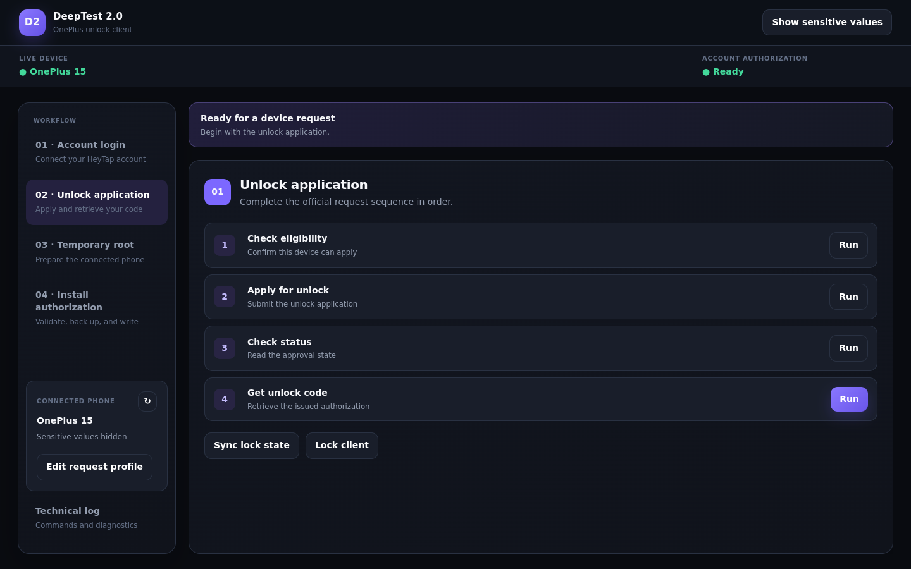

# DeepTest 2.0

DeepTest 2.0 is a desktop GUI for OnePlus/HeyTap DeepTesting workflows. It replaces terminal-heavy commands with a guided interface for login, device detection, authorization, diagnostics, and unlock-code management.

This is an independent GUI built on the protocol implementation and research from [mikoker/deeptest](https://github.com/mikoker/deeptest). Please review the upstream project’s license and documentation.

<p align="center">
  
</p>

## Download a ready-to-run release

### Current device support

The root-helper workflow currently supports:

- **OnePlus 15** (PRJ-ID `24831`, model `PLK110`) on OxygenOS builds **16.0.8.300** and **16.0.9.400**
- **OnePlus Ace 6T** (PRJ-ID `24855`, model `PLR110`) on OxygenOS builds **16.0.1.306**, **16.0.2.401**, **16.0.3.503**, **16.0.5.701**, **16.0.7.200**, **16.0.8.300**, and **16.0.9.401**
- **OnePlus 15T** (PRJ-ID `25821`, model `PLZ110`) on ColorOS builds **16.0.8.300** and **16.0.9.400**

Other devices or OxygenOS build versions are not supported yet.

Open the repository’s [Releases](https://github.com/koaaN/DeepTest2.0/releases) page and download the archive for your operating system.

### Linux

1. Download `DeepTest2-linux-x86_64.tar.gz`.
2. Extract it:

   ```bash
   tar -xzf DeepTest2-linux-x86_64.tar.gz
   ```

3. Start the application:

   ```bash
   ./DeepTest2/DeepTest2
   ```

### Windows

1. Download `DeepTest2-windows.zip`.
2. Extract the ZIP file.
3. Open the extracted `DeepTest2` folder.
4. Double-click `DeepTest2.exe`.

The Windows release includes Platform Tools and `adb.exe`. The Linux release uses system ADB when available; install Android Platform Tools if ADB is not already on your `PATH`.

## Before connecting a phone

- Enable USB debugging.
- Accept the RSA authorization prompt on the phone.
- Keep only the intended device connected.

The Connected Device card shows the live ADB connection. Saved target-device fields may remain visible between launches and do not prove that a phone is connected.

## Main workflow

Use the four sections in the left workflow panel:

1. **Account login**
   - Sign in to your HeyTap account.
   - Enter the verification code and complete any additional verification promptly.

2. **Unlock application**
   - Run **Check eligibility**, **Apply for unlock**, **Check status**, and **Get unlock code** in order.
   - **Check status** often returns the unlock code before the application is shown as approved. If it does not, use **Get unlock code**.
   - The status banner turns green when an unlock code is received.
   - These server-side actions can use the saved request profile when the phone is not connected.

3. **Temporary root**
   - Connect the phone and confirm its identity in the **Connected phone** card.
   - Select the exact installed system version and press **Run root helper**.
   - Keep the phone awake and unlocked. Follow progress in the live output panel or open **Technical log** for full diagnostics.
   - Continue only when DeepTest confirms that temporary root is actually available.

4. **Install authorization**
   - Press **Check requirements** to validate the connected phone, temporary root, and unlock code.
   - All three checks must be ready before **Apply authorization to phone** becomes available.
   - DeepTest backs up the original `oplusreserve1` image before creating and writing a patched copy.
   - After installation succeeds, use **Reboot to bootloader** to continue.

Use **Edit request profile** when detected or saved request values need adjustment. The top status bar shows the live device and account-authorization state, while **Technical log** contains commands, helper output, and server responses.

## Token storage

Login and authorization data is stored locally under:

```text
Linux:   /home/<user>/.config/deeptesting/
Windows: C:\Users\<user>\.config\deeptesting\
macOS:   /Users/<user>/.config/deeptesting/
```

Treat these JSON files as secrets, keep a secure backup somewhere safe, and never upload them. Device settings are also local and are not sent to the repository.

## Backup storage

Before installing unlock authorization, DeepTest saves the original `oplusreserve1` image under:

```text
Linux:   /home/<user>/.local/share/deeptest/reserve-backups/
Windows: C:\Users\<user>\.local\share\deeptest\reserve-backups\
macOS:   /Users/<user>/.local/share/deeptest/reserve-backups/
```

Backups are named `oplusreserve1-preunlock-<device-serial>.img`. Keep a separate copy somewhere safe and never use a backup taken from another phone.

## Building from source

The repository includes separate GitHub Actions workflows for Linux and Windows, plus a combined release workflow.
